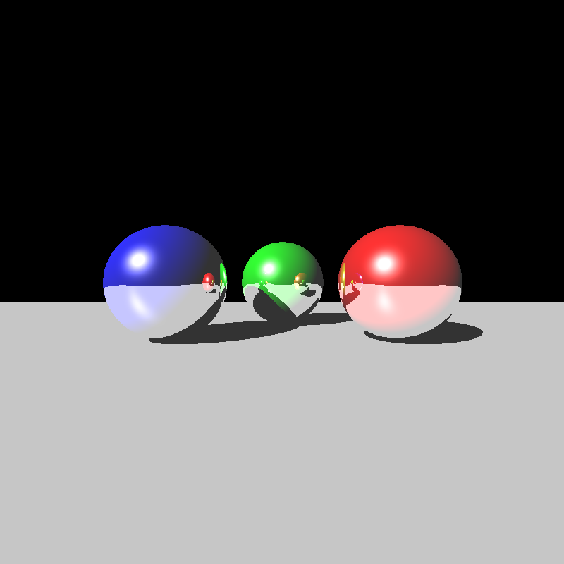
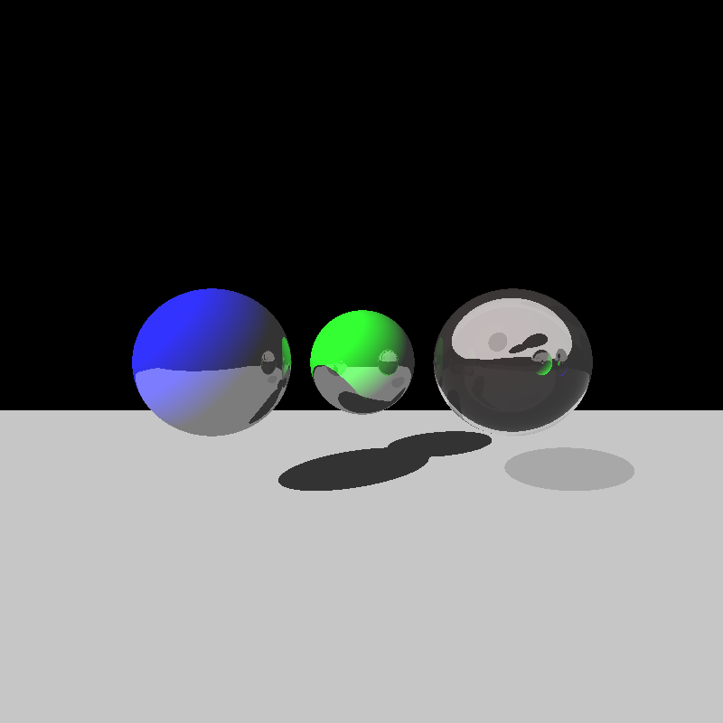
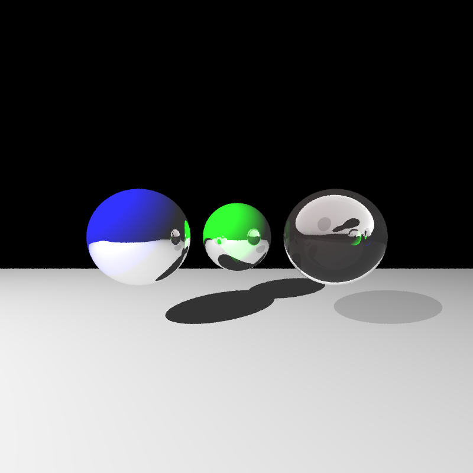

# raytracer-windows

Raytracing learning project.

## Shading methods
Phong shading model (old implementation)            |  Whitted shading model (current implementation)
:-------------------------:|:-------------------------:
  |  

## Anti-aliasing

No anti-aliasing (rending time ~7sec)          |  Anti-aliasing with 5 samples/pixel (rendering time ~36sec)
:-------------------------:|:-------------------------:
  |  

